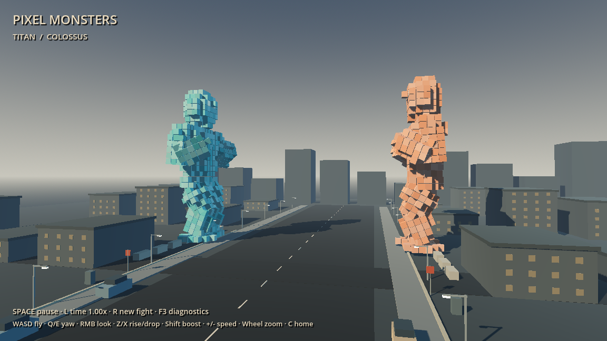
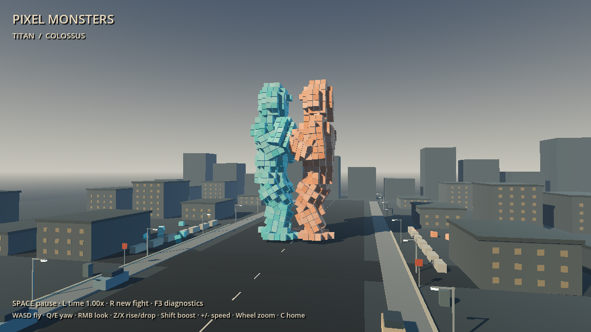
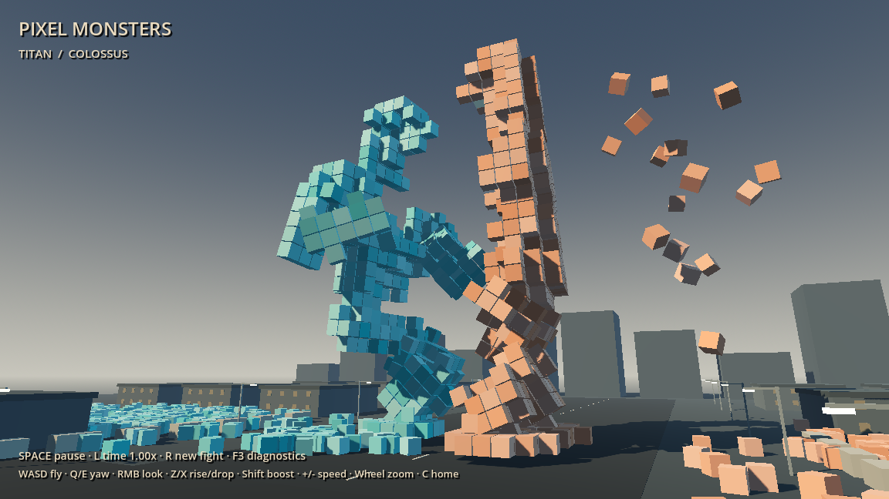
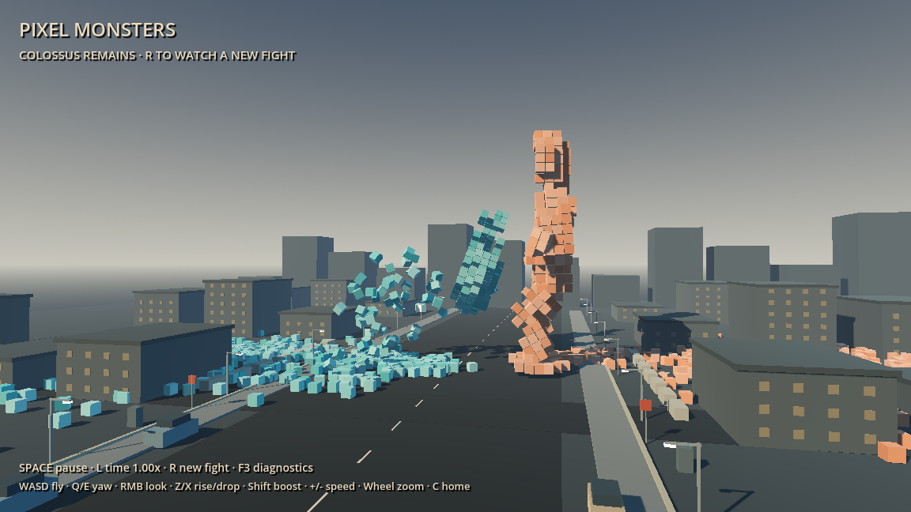
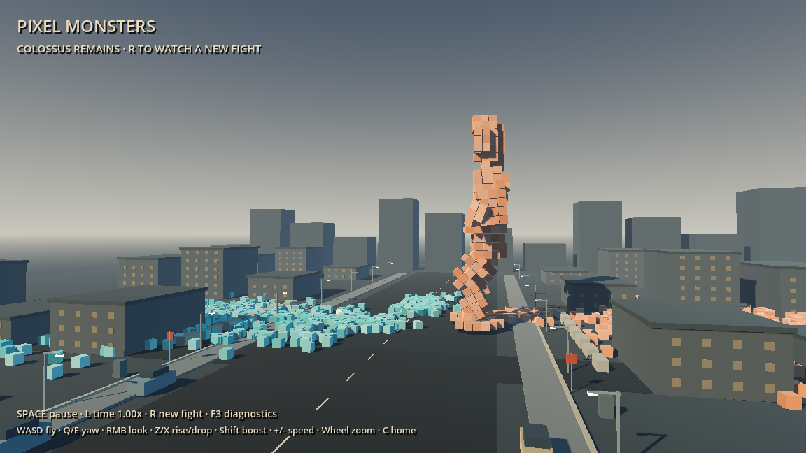

# Pixel Monsters — Milestone 2

The default experience is an autonomous battle. Launching `D:\Pixel Monsters\Play Pixel Monsters.bat` starts two pristine 1,000-cube monsters, a 2.2-second standoff, and a complete fight. No combat input or menu is required. The development project remains at `D:\Godot\Projects\Pixel-Monsters`; the original lab remains in `scenes/prototype.tscn`.

## Implementation

**Movement:** deliberate acceleration, braking, limited turn acceleration, distance management, modest circling/backward steps, stagger and knock response. World-space foot anchors alternate through lifted steps. Two-bone IK bends arms and legs without stretching them. Torso twist, lean, head snap and weight transfer make strikes readable. Soft body separation prevents the roots from occupying the same space.

**Rendering and destruction:** the existing body allocation, localized removal, surviving-cube collision queries and debris pool were extended. Combat uses 19 region MultiMeshes per monster. The rig moves each region as a batch; individual cube poses and the impact spatial index refresh on demand for collision/destruction. Removed cubes stay removed. The physical debris pool remains capped at 192 bodies, with settled/overflow rubble batched separately. Rubble persists until reset.

**Combat:** `request_move` and `request_attack` form a shared controller interface, ready for future human control. Each attack has wind-up, commitment, a swept contact interval, follow-through and recovery. The committed target stops tracking during the stroke. Contacts use surviving body geometry; damage is local cube removal, not a separate health bar.

| Attack | Wind-up / commitment / follow / recovery | Initial destruction radius | Behavior |
|---|---|---:|---|
| Left punch | 0.70 / 0.38 / 0.32 / 1.10 s | 1.65 m | Concentrated left-hand strike |
| Right punch | 0.76 / 0.40 / 0.34 / 1.15 s | 1.70 m | Concentrated right-hand strike |
| Heavy hook | 1.12 / 0.48 / 0.45 / 1.50 s | 2.45 m | Arcing swing, lateral debris and stronger interruption |
| Kick | 0.95 / 0.46 / 0.32 / 1.45 s | 2.05 m | Healthier usable leg; low targets and substantial recoil |
| Headbutt | 0.78 / 0.44 / 0.34 / 1.30 s | 1.95 m | Close weight transfer; attacker head reaction |
| Body drive | 1.00 / 0.70 / 0.45 / 1.65 s | 2.55 m | Torso commitment; useful after limb loss |

Impact radius increases modestly later in the fight, capped at 32% above the initial profile. This changes physical destruction only; it does not prescribe injuries or a winner.

**AI:** independent controllers think approximately 2.5–4 times per second. They evaluate distance, facing, recovery, incoming wind-up, surviving anatomy, recent moves and repositioning. Weighted selection discourages repeats. Titan favors aggression/hooks; Colossus favors kicks and more bracing/evasion. Guards physically move surviving arms into the contact path. A minority of choices exploit visibly damaged joints. Missed strikes encourage closer positioning; target selection accounts for the opponent's lowered stance. All six moves caused damage in the final batch.

**Structural adaptation:** lost arms disable their attacks. A hand/forearm/upper-arm chain must also retain sufficient material to strike. Losing the selected limb cancels an attack already in progress. With no usable hands, kick/headbutt/body-drive weights increase. Legs have healthy, damaged, compromised and lost states; remaining thigh/shin material controls speed, turn ability and kicking. One lost leg produces a lowered stance; both lost legs produce a slow grounded stance based on the lowest surviving torso material. Arm or leg loss alone is nonfatal.

**Defeat:** essential neck failure (4 or fewer cubes), head destruction (20 or fewer), catastrophic torso loss (104 or fewer), or combined pelvis/abdomen support failure ends combat. The loser tilts and loses cohesion into debris. The winner remains; no automatic reset occurs.

**Presentation:** restrained HUD, warm/cool lighting, haze, shadows, streets, sidewalks, varied miniature buildings, cars, lamps, signs and utility cabinets. Spatial sound layers generated deep impacts and fracture audio with different pitch/volume for attack strength, a delayed low boom for heavy blows, and quiet footfalls. Camera impulses scale with power, removed material and distance. No music or next-milestone systems were added.

## Observer controls

WASD fly; Q/E smooth yaw; RMB + mouse look; Z/X rise/drop; Shift boost; +/- camera speed; wheel FOV; C home. Space pauses/resumes. L cycles 1x, 0.5x and 0.25x. Camera flight remains active while paused or slowed. R starts a new seeded fight. F3 reveals diagnostics; Tab selects the debug monster, 1/2 damage shoulders, 3 damages a leg, 4 damages the neck, and F requests a hook. Normal launches hide these developer tools.

## Validation and measurements

36 complete seeded simulation fights were run during development, plus five rendered full-fight runs inspected across opening, exchanges, damage and aftermath. Forced anatomy scenarios additionally exercised both-arm loss, one-leg loss, all-four-limb loss, essential failure and reset. The final six 60 Hz fights all passed: **95.9–173.0 seconds**, with a longest damaging-contact gap of **11.5 seconds**. Both contestants won. Six original destruction tests (1,093 assertions) and 20 new combat checks pass.

| Rendered checkpoint | Uncapped FPS | Effective average frame interval | Active debris |
|---|---:|---:|---:|
| Pristine release, 2–5 s samples | 1,217 | 0.82 ms | 0 |
| 25% total body destruction | 1,146 | 0.87 ms | 41 |
| 50% total body destruction | 1,196 | 0.84 ms | 85 |
| Severe pre-defeat development run, 70% destruction, 3 s average | 1,425 | 0.70 ms | 10 at sample end |
| Final release collapse, 77% destruction | 1,055 | 0.95 ms | 192 |
| Final release aftermath, 4–10 s after ending | 1,181 | 0.85 ms | settling to 0 |

The final release fight ended at **171.1 seconds**, with Colossus surviving on 466 cubes and 1,534 rubble cubes retained. In that run, localized impact queries averaged **0.126 ms** (maximum **0.208 ms**); complete destruction events averaged **2.12 ms** (maximum **3.26 ms**); structural checks averaged **0.765 ms** (maximum **1.81 ms**). Both rigs typically cost approximately **0.10–0.14 ms** together, and combined AI decisions approximately **0.03 ms**. A separate worst-case headless benchmark measured emission of an intact 1,000-cube body in approximately **8.6 ms**, retaining the 192-body cap. Framebuffer readback/PNG evidence capture creates extra one-off stalls and is excluded from normal-play performance conclusions.

Rendered measurements use the RTX 2070 SUPER at 1152×648, with VSync disabled for profiling. FPS checkpoint values are observations, not guarantees; normal play uses VSync. Headless runs validate logic rather than GPU performance. AI, rig, structural and destruction timings are recorded separately. Collision bodies are fixed at 193 including the ground; active debris never exceeds 192.

Observed bugs fixed: expensive per-cube animation updates; kick recovery aimed at a hand anchor; crippled opponents targeted at the wrong height; repeated misses without closing; unusable hands still eligible for attacks; selected-limb loss during commitment; and floating grounded stances. The worst observed late contact gap fell from 141 seconds to 11.5 seconds in the final seeded batch.

## Limits and next targets

Balance, falls and reactions remain procedural approximations. Some extreme poses expose seams or intersect surviving segments. Joint failure uses regional material thresholds rather than a full load-bearing connectivity solver. Rubble collides with the floor, not with buildings or other rubble. Body separation is a simple planar constraint. Personality balance currently favors Titan in the final six seeds. Export tooling still emits existing editor-addon/engine cleanup warnings; these are separate from the playable release checks.

Recommended Milestone 3 targets: improve articulation and grounded attacks, connectivity-aware structural support, more convincing falls and rubble interaction, broader personality/pacing tests, then limited environmental destruction. Milestone 3 has not been started.

## Handoff

Gameplay checkpoint: **62d7b71**. Windows release version **0.2.0.0** is exported to `D:\Pixel Monsters\Pixel Monsters.exe`. The BAT directly starts that executable with no development-project arguments. Release verification records `debug_build=false`, no command-line arguments, and the normal window title **Pixel Monsters**. Build data and the bundled DLL remain beside the executable. The README in the playable folder contains the new observer controls.

Evidence and raw reports: `battle-simulation.json`, `combat-validation.json`, `release-validation.json`, `release-runtime.json`, and `evidence/milestone02/`. The optional local verification recorder is inactive during normal launches.

